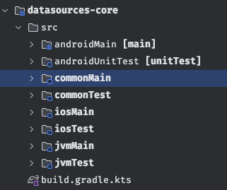
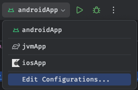
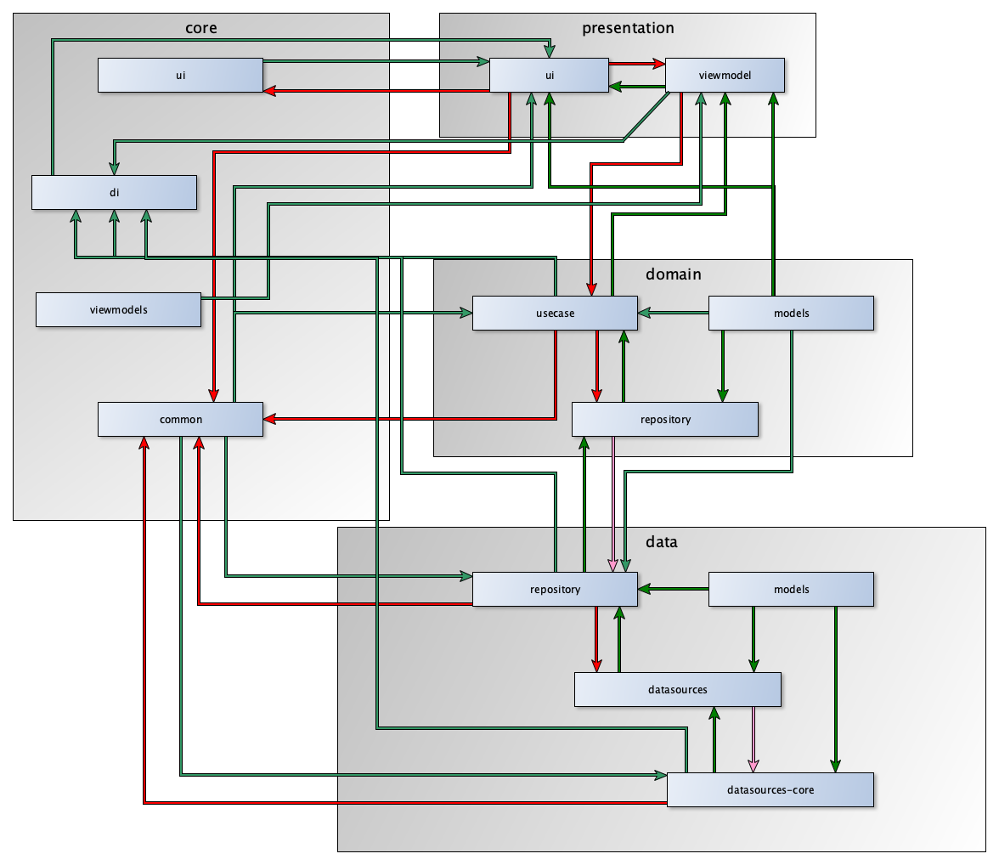
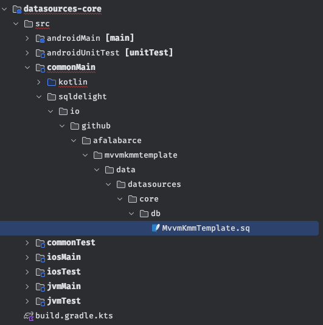

# Plantilla MVVM Kotlin MultiPlatform

Esta plantilla está pensada para facilitar el desarrollo de aplicaciones multiplataforma, utilizando
el framework [KMP (Kotlin MultiPlatform)](https://kotlinlang.org/docs/multiplatform.html). Además se 
ha dotado de las dependencias necesarias para que, **utilizando una única base de código**, podamos 
construir tanto las capas de negocio como las de presentación.

Para la capa de presentación se han agregado las dependencias necesarias para poder diseñar las 
interfaces de usuario utilizando [JetpackCompose Multiplatform](https://www.jetbrains.com/lp/compose-multiplatform/),
lo que va a redundar en un mayor control, y sobre todo, una base de código común en la que no tendremos que
diseñar UI específicas a cada plataforma.

A continuación, se expondrán tanto las preconfiguraciones previas a realizar, como una explicación exhaustiva
de lo que la plantilla ofrece en cuanto a arquitectura, librerías y funcionalidades desplegadas.

## Configuración previa

La primera vez que creemos un proyecto multiplatform, vamos a necesitar de varias configuraciones previas, en los
entornos MacOS (el desarrollo para iOS tiene sus cosillas), las cuales nos ayudarán en la correcta configuración 
del sistema, evitando errores posteriores de compilación. Por tanto, deberemos prestar especial atención a
los siguientes puntos:

- **Comunes a todos los Sistemas Operativos (Windows, MacOs, Linux)**:
  - Instalar el JDK 17, si no lo tenemos instalado aún.
  - Agregar en la raíz del proyecto un fichero local.properties en el que establezcamos el path
  al SDK de Android.
  - Agregar el plugin [Kotlin Multiplatform Mobile plugin](https://plugins.jetbrains.com/plugin/14936-kotlin-multiplatform-mobile)
- **Específico en sistemas MacOs (para desarrollo iOS)**:
  - Comprobar que el sistema cumple los requisitos mínimos para desarrollos KMP para iOS con
    [KDoctor](https://github.com/Kotlin/kdoctor).

## Estructura de un módulo KMP

Todo proyecto definido para **K**otlin **M**ulti**P**latform tiene una estructura claramente definida, que, nos permitirá
la generación de código personalizado en cada plataforma, teniendo la posibilidad de, por ejemplo, definir una función de forma común pero que, 
en función de la plataforma, deberá ser inicializada de una forma u otra.

Veamos a continuación la estructura típica para un módulo KMP (en este caso, para un módulo que soporta las plataformas 
Android, iOS y JVM - Desktop -):

| Estructura del módulo                       |                                                                                                                                                                                                                                                                                    |
|---------------------------------------------|:-----------------------------------------------------------------------------------------------------------------------------------------------------------------------------------------------------------------------------------------------------------------------------------|
|  | Como podemos ver, esta estructura es la más compleja que vamos a obtener, ya que aparte de los propios módulos de código específicos de cada plataforma, disponemos además de su correspondiente módulo de testing. Veamos a continuación las particularidades de esta estructura. |

Cada carpeta definida en el módulo contendrá exactamente la misma estructura de carpetas (package), a fin de que en el caso de que requiramos redefinir una clase o una 
funcionalidad, lo podamos hacer sin mayores problemas. A continuación especificaremos qué hace y para qué sirve cada uno (aunque está bastante claro en base a los nombres):

- **androidMain**, contiene las definiciones y código específicos de Android. En esta sección deberemos inicializar todo lo necesario para la plataforma Android, es decir,
aquí en el caso de tener que instanciar algún tipo de objeto que requiera un Context o cualquier otra API específica de Android, se podrá realizar aquí sin mayor problema.
- **androidTest**, contiene las implementaciones de test unitarios que requieran elementos específicos de Android. De este modo, si en [androidMain] hemos instanciado algún
objeto específico, podremos testearlo aquí.
- **commonMain**, en este módulo es donde vamos a tener el grueso de implementaciones, así como las expect class cuya implementación se delega a cada plataforma.
- **commonTest**, contiene las implementaciones de test unitarios que no requieren de elementos específicos de una plataforma.
- **iosMain**, contiene, **en lenguaje Kotlin**, implementaciones específicas para la plataforma iOS, se implementarán inicializaciones específicas de objetos, o acceso a api
a través del puente Kotlin-Swift que implementa KMP.
- **iosTest** contiene las implementaciones de test unitarios que requieran elementos o instancias específicas la plataforma iOS. Se utiliza al igual que en
[iosMain] el puente Kotlin-Swift.
- **jvmMain**, este módulo contiene las implementaciones específicas para las ejecuciones en escritorio (ya sean MacOS, Linux, Windows), por lo que se utilizará cualquier elemento
que nos proporciona la JVM estándar.
- jvmTest, contiene las implementaciones de tests unitarios que requieran elementos espécificos de la JVM y que, por tanto no sean de interés para el resto de plataformas.

### Definiciones expect

En KMP se introduce, o se hace necesario, el uso de funciones o clases marcadas con la palabra reservada **expect**, estas funciones y/o clases se definen en el módulo
[commonMain], pero se implementan en cada plataforma, marcando su implementación con la palabra reservada **actual**. A tener en cuenta que, para realizar la implementación, se requiere
de una nomenclatura particular, por ejemplo, si en [commonMain] tenemos el fichero (definido por su package) [io.afalabarce.mvvmkmmtemplate.data.datasources.core.db.DriverFactory.kt] 
en el resto de plataformas, deberemos definir un fichero que será en el que realizaremos la implementación de la clase (o función expect) que requiramos:
- **[io.afalabarce.mvvmkmmtemplate.data.datasources.core.db.DriverFactory.android.kt]**, se realiza la implementación de la clase / funciones utilizando elementos propios de android.
- **[io.afalabarce.mvvmkmmtemplate.data.datasources.core.db.DriverFactory.ios.kt]**, se realiza la implementación de la clase / funciones utilizando el puente Kotlin - Swift proporcionado por KMP.
- **[io.afalabarce.mvvmkmmtemplate.data.datasources.core.db.DriverFactory.jvm.kt]**, se realiza la implementación de la clase / funciones utilizando elementos de la JVM estándar.

Veamos un ejemplo, precisamente con el fichero propuesto como ejemplo:

#### Definición en commonMain

```kotlin
expect class DriverFactory {
    fun createDriver(): SqlDriver
}
```

#### Implementación para plataforma Android

```kotlin
actual class DriverFactory {
  private val context: Context by inject(Context::class.java)
  actual fun createDriver(): SqlDriver {
    return AndroidSqliteDriver(
      KmmDatabase.Schema,
      this.context,
      Database.databaseName)
  }
}
```


#### Implementación para plataforma iOS

```kotlin
actual class DriverFactory {
    actual fun createDriver(): SqlDriver {
        return NativeSqliteDriver(
            KmmDatabase.Schema,
            Database.databaseName
        )
    }
}
```

#### Implementación para Escritorio (JVM)

```kotlin
actual class DriverFactory {
    actual fun createDriver(): SqlDriver {
        val driver: SqlDriver = JdbcSqliteDriver(JdbcSqliteDriver.IN_MEMORY)
        KmmDatabase.Schema.create(driver)
        return driver
    }
}
```

Como vemos en cada implementación se define una clase KmmDatabase, esta clase es generada por el compilador, ya que es ese nombre el que hemos dado en la configuración
de gradle para la base de datos basada en SqlDelight.

Como podemos ver, una vez marcamos la clase como expect, todas sus implementaciones, deben ir marcadas como actual, al igual que las funciones o propiedades que pueda contener.


## Ejecución de la app en las distintas plataformas

Se han proporcionado tres tareas de proyecto para la ejecución de la app desarrollada en cada plataforma,
de este modo podremos ahorrarnos el proceso de lanzarlas desde consola con las correspondientes tareas
de gradle:



Aún así se podrán ejecutar lanzando las siguientes tareas:

### Android

- Ejecutar la tarea `./gradlew :presentation:ui:assembleDebug`
- Buscar el fichero `.apk` en la ruta `presentation/ui/build/outputs/apk/debug/composeApp-debug.apk`

### Escritorio

- Lanzar la aplicación de escritorio con la tarea `./gradlew :presentation:ui:run`

### iOS

Para lanzar la aplicación en un emulador iOS, tendremos dos posibilidades:
- Abrir el proyecto `iosApp/iosApp.xcproject` en XCode y ejecutarlo con la configuración estándar.
- Utilizando el plugin KMP, desde el propio Android Studio.

## Arquitectura del Proyecto

La Arquitectura de este proyecto se basa en el clásico Clean Architecture, con algunas particularidades
que, creo, lo hacen interesante tanto a nivel didáctico como productivo, ya que proporciona una separación
total de cada capa, permitiendo un desacople máximo en cada sección. Así pues, de forma esquemática (sin entrar
en la estructura interna creada para KMP), podemos ver todos los módulos definidos en la siguiente imagen:

Teniendo en cuenta lo siguiente (siempre pensando en Origen -> Destino):
- <span style="color:#339966">**Flechas Verdes**</span>, Módulo A es dependencia de Módulo B
- <span style="color:#ff0000">**Flechas Rojas**</span>, Módulo A utiliza funcionalidad de Módulo B
- <span style="color:#ff99cc">**Flechas Rosas**</span>, Módulo A es implementado en Módulo B



Como podemos apreciar en la imagen, el proyecto se divide de forma "superficial" en cuatro capas, las cuales a 
su vez implementarán cada módulo que abstraerá y protegerá el acceso indebido desde un módulo a otro.
A continuación se expone la funcionalidad de cada capa, así como la de cada módulo que la compone:

- **core**, es una capa transversal, la cual dispone de módulos accesibles a capas concretas, para acciones concretas
pero a su vez, dispone de módulos visibles para todas las capas, en los que se proporcionan funcionalidades que 
pueden ser de utilidad común. Veamos cada uno de los módulos que componen esta capa:
  - *common*, este módulo es visible para todas las capas y proporciona métodos útiles que pueden ser usados en cualquiera
  de las capas del proyecto (por ejemplo, proporciona métodos que nos indican el sistema en el que se ejecuta la app).
  - *viewmodels*, este módulo sólo es visible por el módulo de viewmodels de la capa **presentation**, y proporciona
  funcionalidad básica para gestión y manipulación de estados en los viewmodels.
  - *di*, este módulo tan solo recopila los distintos objetos de inyección de dependencia de cada módulo, para proporcionarlos
  al **módulo ui de la capa presentation**, a fin de gestionar correctamente el árbol de dependencias.
  - *ui*, este módulo sólo es visible por el **módulo ui de la capa presentation**, se proporciona en este módulo tanto el tema
  de JetpackCompose, como composables de uso general. Lo ideal es que esta capa albergue abstracciones de los componentes a utilizar,
  ya que de este modo, si se modifica algún elemento de compose, la UI principal no se verá afectada. Por ejemplo, podemos 
  desarrollar los composables de TextField, Button, PasswordTextField, etc, adaptados al theming que requiramos.
- **data**, esta capa es la responsable de gestionar **todos** los orígenes de datos de los que se va a alimentar la app. idealmente,
gestionará incluso las posibles obtenciones de datos de gps, bluetooth, etc, además de las clásicas peticiones a servicios REST,
Bases de datos locales, gestión de preferencias, etc. A continuación, se comenta la funcionalidad y responsabilidad de cada uno de los
módulos que componen esta capa:
  - *models*, este módulo mantiene, idealmente separados por feature, los modelos de datos tanto de bases de datos locales como remotos.
  - *repository*, en este módulo **se implementan las interfaces de repositorio definidas en el módulo domain:repository**, además es el
  responsable de la implementación / definición de los distintos mapeadores hacia/desde entidades de dominio (**domain:models**) a entidades
  de bases de datos o remotas.
  - *datasources*, en este módulo se definen las interfaces que gestionarán todas y cada una de las peticiones a orígenes de datos. Este módulo
  está **referenciado por el módulo de data:repository**.
  - *datasources-core*, este módulo es el responsable de centralizar todas las implementaciones de las interfaces definidas en **data:datasources**,
  siendo por tanto el **único módulo de todo el proyecto con capacidad de conexión a sistemas externos y/o bases de datos locales**.
- **domain**, En esta capa gestionamos la lógica de negocio que aglutina los métodos de los repositorios en las distintas clases de caso de uso, a fin
de acotar y atomizar las peticiones, para utilizar única y exclusivamente las funcionalidades necesarias en un momento dado.
  - *models*, en este módulo definiremos, idealmente, por feature los distintos modelos de datos de dominio, que serán utilizados por las capas de presentación
  y que se nos proporcionan ya mapeados desde los repositorios.
  - *repository*, en este módulo se definen las interfaces de comunicación que serán implementadas en el módulo **data:repository**. Estas interfaces son,
  en último término, el contrato de comunicación entre la capa de acceso a datos y la capa de presentación.
  - *usecases*, este módulo es el responsable, organizando todo por feature, de la abstracción de las llamadas de los repositorios acotando cada caso de uso
  a una funcionalidad concreta, esto quiere decir que un caso de uso no debería implementar más de una funcionalidad, por ejemplo, GetDeviceIdUseCase, 
  SetDeviceIdUseCase, etc.
- **presentation**, esta es la capa responsable de la interactuación con el usuario, en la que definiremos tanto la UI como el sistema de obtención de datos
desde la capa de dominio, a través de ViewModels.
  - *viewmodels*, este módulo es el responsable, organizado por feature, de gestionar las distintas peticiones y manipulación de datos y estados, a partir de los
  casos de uso, a través del módulo **domain:usecases**, proporcionando a la UI la información de forma reactiva, garantizando por tanto que, aparte de 
  que la UI no quedará congelada, tendremos un único punto de recolección y actualización de datos.
  - *ui*, este módulo se encargará de la presentación de la información proporcionada por los distintos viewmodels definidos en el módulo
  **presentation:viewmodels**, debemos prestar atención a que idealmente **no deberíamos utilizar componentes genéricos de compose, en beneficio de componentes
  propios**, ya que de este modo, conseguiremos extraer la responsabilidad de futuros cambios de funcionalidad o apariencia a un único punto.

En este punto, hemos definido qué hace cada módulo en cada capa, pero queda pendiente explicar / definir lo expuesto en el esquema gráfico. 
Veamos por módulo cuales son sus dependencias:

- **Prácticamente todos los módulos**, dependen de core -> common, por lo que no es necesario indicar esta dependencia.
- **domain -> repository**, requiere de la inclusión de las siguientes dependencias:
  - *domain -> models*, ya que en [domain -> repository] es donde se definen las interfaces que van a proporcionar los datos obtenidos de los distintos orígenes de datos
  ya mapeados a las entidades de dominio definidas en esta capa.
- **domain -> usecases**, se definen en este módulo las siguientes dependencias:
  - *domain -> models*, ya que, [domain -> usecases] tiene como valores de retorno entidades de dominio, requiere de este módulo para poder realizar esta labor.
  - *domain -> repository*, los casos de uso definidos en [domain -> usecases] requieren de los datos que se devolverán desde las funciones que se definen en las interfaces
  descritas en este módulo.
- **data -> datasources**, tiene las  siguientes dependencias:
  - *data -> models*, ya que requiere los modelos de datos (locales y remotos)
- **data -> datasources-core**, requiere las siguientes dependencias:
  - *data -> datasources*, ya que es en [data -> datasources-core] donde se realiza la implementación de las interfaces definidas
  en este módulo.
  - *data -> models*, ya que requiere los modelos de datos (locales y remotos) para la implementación de las interfaces definidas en el punto anterior.
- **data -> repository**, requiere las siguientes dependencias:
  - *data -> datasources*, ya que es [data -> repository] donde se realiza la interpretación de los resultados de datasources y su adaptación a entidades de dominio.
  - *data -> models*, ya que utiliza y es necesaria por los resultados proporcionados por la dependencia anterior.
  - *domain -> models*, ya que es en [data -> repository] donde se realiza el mapeo de entidades de datos (locales y remotas) a entidades de dominio.
  - *domain -> repository*, ya que en [data -> repository] es donde se implementan las interfaces definidas en este módulo.
- **presentation -> viewmodels**, esta capa requiere las siguientes dependencias:
  - *domain -> models*, en las capas de presentación y dominio, tan solo recolectamos datos en base a las entidades de dominio definidas en este módulo.
  - *domain -> usecases*, los viewmodels tienen como única fuente de datos a los resultados proporcionados por los distintos casos de uso definidos en este módulo.
  - *core -> viewmodels*, esta dependencia proporciona ciertas funcionalidades que pueden ser aprovechadas por el módulo de [presentation -> viewmodels].
- **presentation -> ui**, la capa de presentación presenta las siguientes dependencias:
  - *domain -> models*, en la capa de presentación, tan solo recolectamos datos en base a las entidades de dominio definidas en este módulo.
  - *presentation -> viewmodels*, la capa de presentación, obtiene y proporciona feedback a recursos de datos tanto locales como remotos **únicamente a través de los viewmodels
  relacionados**.
  - *core -> di*, ya que el proveedor de dependencias (Koin) debe gestionarse desde la capa de presentación es preciso pasarle el árbol de dependencias de forma aséptica, lo que
  conseguimos incluyendo esta dependencia y un objeto concreto que define todo el árbol.
  - *core -> ui*, gracias a este módulo, vamos a centralizar toda la apariencia y theming de la app, para ello, es en este módulo donde se definirá el tema la app, así como los
  componentes básicos (ya con los valores de tema aplicados) que se van a utilizar en la app.

Como podemos apreciar, en base a la descripción de las distintas dependencias que hemos definido, tenemos la seguridad de que cada capa sólo es visible por la capa / módulo correcta
evitando por completo posibles accesos indebidos, ya sea de forma intencionada o errónea.
  
## Funcionalidades implementadas (por capa)

### Core

En la capa core, se implementan algunas de las funcionalidades básicas de toda la app, particularmente se gestionan los distintos elementos que van a permitirnos gestionar
tanto el árbol de inyección de dependencias como la gestión de Viewmodels. Veamos, por cada módulo las posibiliades más interesantes que nos proporciona:

#### Common

En este módulo se define una de las funcionalidades más importantes de todo el proyecto, ya que nos permite gestionar de forma relativamente sencilla todo el proceso de provisión de 
dependencias en todo el proyecto (de ahí que este módulo sea dependencia directa del resto de módulos del proyecto).

En el package [io.github.afalabarce.mvvmkmmtemplate.core.common.di] se define la interfaz **KoinModuleLoader**, la cual expone una propiedad de solo lectura
llamada **koinModules**, que no es más que una lista de módulos de koin.
Esta interfaz la implementaremos en cada módulo que requiera de inyección de dependencias, por ejemplo,
[data -> datasources-core], [data -> repository], [domain -> usecases] y [presesntation -> viewmodels].

Su utilización es muy sencilla, veámoslo con un ejemplo de código (extraido de [data -> datasources-core]):

```kotlin
object DataSourceCoreDependencyInjector: KoinModuleLoader {
    override val koinModules: List<Module>
        get() = getPlatformInjects().union(
            listOf(
                module {
                    single <ApiService>{
                        Ktorfit
                            .Builder()
                            .baseUrl(ApiService.API_URL)
                            .build()
                            .create()
                    }
                    singleOf(::Database)
                    single<AppPreferences>{ AppPreferencesImpl(get()) }
                }
            )
        ).toList()
}
```

Como vemos, lo más sencillo es crear un objeto que implemente la interfaz, y directamente definir el módulo con las dependencias propias del módulo.
Además se proporciona un método getPlatformInjects que está marcado como **expected** a fin de que en cada plataforma definamos las dependencias que corresponda, es decir, en función de una plataforma 
u otra, se definirán ciertas dependencias que sean requeridas por un sistema u otro (**ver ejemplos definidos en la capa**).

Aparte, dispone de ciertas funciones de extensión, que de un modo u otro nos van a facilitar diversas operaciones (sobre todo formateo de objetos y conversiones seguras entre tipos).

#### ViewModels

En este módulo tan solo se ha definido una clase KmmViewModel (hereda de Viewmodel) que implementa un método de extensión a los CoroutineScope que permite una ejecución segura de un método de suspensión, ya que nos permite gestionar de forma 
sencilla los posibles errores. Así pues, nuestros ViewModel deberán ser similares al siguiente ejemplo:

```kotlin

class MyViewModel(
    private val myUseCase: MyUseCase
): KmmViewModel() {
    val myUseCaseResult by lazy { myUseCase.flowResult.stateIn(viewModelScope, SharingStarted.Lazily, initialValue) }
  
    fun queryResult() {
        viewModelScope.safeLaunch(
            onStart = { /* do on start */ },
            onFinish = { /* do on finish */ },
            onError = { /* do on raised error */ },
            onStartContext = Dispatchers.Main,
            onFinishContext = Dispatchers.Main
        ) {
            // Suspend query calls
        }
    }
}

```

#### Di

Este módulo es el responsable de centralizar los distintos árboles de dependencia de cada módulo, aglutinando todos en un 
único árbol que nos va a permitir la generación sencilla de las dependencias, minimizando además los posibles errores, por estar
acotado cada módulo.

Para ello, tan solo se genera un objeto llamado [io.github.afalabarce.mvvmkmmtemplate.core.di.CoreDependencyInjection] el cual proporciona,
al igual que el resto de objetos de dependencia, la implementación de la interfaz [io.github.afalabarce.mvvmkmmtemplate.core.common.di.KoinModuleLoader].

Al contrario que sucede con la inyección de dependencias de otros módulos, en este no es preciso agregar nada (salvo que, modifiquemos la arquitectura y agreguemos 
nuestros propios módulos).

Por todo lo indicado en los párrafos anteriores, **esta capa no es preciso alterarla**. 

#### Ui

Este módulo será el responsable de centralizar todo el subsistema de vistas generales, así como la gestión del tema. Para ello, se ha personalizado el diseño del tema 
de la aplicación dotándolo de algunas funcionalidades interesantes que, el tema por defecto proporcionado por la definición de JetpackCompose no tiene. Veamos a continuación
de qué estamos hablando:

El módulo proporciona un AppMaterialTheme, el cual implementa, aparte de lo proporcionado por MaterialTheme, una nueva propiedad llamada [dimens] la cual almacena la configuración
de dimensiones para el proyecto, así pues, estos valores se almacenan en un objeto de tipo MobileDimens, el cual tiene la siguiente firma:

```kotlin
class MobileDimens(
    val none: Dp,
    val topSurface: Dp,
    val startSurface: Dp,
    val endSurface: Dp,
    val bottomSurface: Dp,
    val minTopSurface: Dp,
    val minStartSurface: Dp,
    val minEndSurface: Dp,
    val minBottomSurface: Dp,
    val mediumMarginTopSurface: Dp,
    val mediumMarginStartSurface: Dp,
    val mediumMarginEndSurface: Dp,
    val mediumMarginBottomSurface: Dp,
    val largeTopSurface: Dp,
    val largeStartSurface: Dp,
    val largeEndSurface: Dp,
    val largeBottomSurface: Dp,
    val appMargin: Dp,
    val textFieldCorner: Dp,
    val smallIconSize: Dp,
    val buttonHeight: Dp,
    val dialogCorner: Dp,
    val focusedBorder: Dp,
    val cornerRadius: Dp,
)
```

Como podemos apreciar, se cubren la mayoría de parámetros que una app puede tener (si requerimos algún nuevo parámetro tan solo deberemos agregarlo).

Además, durante la recomposición se proporciona una precarga basada en LocalComposition, llamada [LocalDimension], la cual, mediante [LocalDimension.current]
 nos permitirá acceder a la configuración de dimensiones del sistema.

También se proporcionan unos shape por defecto, y un par de shapes personalizados, para que se pueda apreciar la potencia de compose a la hora de diseñar formas.

Gracias a los elementos de que disponemos, es en el módulo de Core-UI donde vamos a definir los componentes genéricos que nuestra app va a usar, es decir, deberíamos
**prohibir** el uso de composables de las apis generales en nuestra app, definiendo wrappers propios, con nuestro tema, y que serían los utilizados en el sistema, 
así gracias a esto, en el caso de que se produzca algún cambio en las apis generales, tan solo deberemos modificar las dependencias y referencias / llamadas en un único 
punto, siendo más sencillo un posible refactor.

### Capa data

Es en esta capa donde disponemos de más funcionadlidades implementadas y quizá las más complejas de describir, para ello se va a intentar ser lo más explícito posible en la explicación 
de las funcionalidades, así como su uso / despliegue. 

**NOTA**: A tener en cuenta que, salvo en el módulo [datasources-core], no debería ser necesario realizar implementaciones específicas a cada plataforma en el resto de módulos.

Comencemos, a partir de los módulos más internos:

#### Models

En este módulo, definiremos las data class necesarias para la gestión correcta tanto de las entidades locales, como remotas.
A tener en cuenta que, ya que utilizamos SqlDelight como motor de persistencia local, vamos a tener que definir nuestras entidades 
locales de un modo un poco especial (aplica el mismo formato a entidades para remote):

```kotlin
import kotlinx.serialization.SerialName
import kotlinx.serialization.Serializable

@Serializable
data class ExampleEntity(
    @SerialName("id")
    val id: Long,
    @SerialName("title")
    val title: String,
    @SerialName("description")
    val description: String
)
```

Como consejo, lo ideal es distribuir los distintos modelos de datos en base a sus feature, organizando en local o remote en función de las 
necesidades.

#### Datasources

Esta capa no es más que la definición de las interfaces de comunicación entre la implementación de los repositorios y la propia implementación de 
estas interfaces o contratos, teniendo en cuenta que los tipos devueltos serán los definidos en el módulo 
[data -> models]. No tiene necesidad de más explicaciones este módulo.

#### Datasources-core

Esta capa es la que, con diferencia, tiene un mayor nivel de complejidad a nivel de proyecto ya que, entre otras, tiene las implementaciones y definiciones de 
los distintos orígenes de datos de la app, entre los que destacan (los veremos a continuación en mayor detalle):

- **Ktor + Ktorfit**, como sistema de conexión a APIs externas (REST principalmente.)
- **Jetpack Datastore**, como sistema de almacenamiento de preferencias.
- **SqlDelight**, como "ORM" y capa de acceso a datos.

Veamos en detalle cada uno de estos sistemas de acceso a datos:

##### **Ktor + Ktorfit**

[Ktor-Client](https://ktor.io/docs/getting-started-ktor-client.html) es el estándar de facto en la gestión de comunicaciones externas, por ejemplo a APIs REST, pero si bien no es excesivamente complejo su uso, queda eclipsado por el 
sistema utilizado de forma constante en Android, esto es, [retrofit](https://square.github.io/retrofit/). Para subsanar este "problema" y permitir una curva de aprendizaje casi plana, el desarrollador
[Foso Github](https://github.com/Foso) ha creado un plugin y sus correspondientes librerías para KMP, llamado [Ktorfit](https://github.com/Foso/Ktorfit) gracias al cual, podemos utilizar APIs en KMP al estilo de como
las utilizamos en Android.

A continuación se muesta la definición de una interfaz típica utilizada con Ktorfit:

```kotlin
interface ApiService {
    @GET("/api/values")
    suspend fun getAllItems(): List<String>

    @POST("/api/values")
    suspend fun putAllItems(@Body items: List<String>)
    companion object {
        const val API_URL = "https://your.own.api"
    }
}
```

Como podemos ver, la definición de la interfaz, es idéntica a lo que ya conocemos de retrofit.

Para crear la instancia del ApiService, nos apoyaremos en el inyector de dependencias, esto es, Koin:

```kotlin
expect fun getPlatformInjects(): List<Module>

object DataSourceCoreDependencyInjector: KoinModuleLoader {
    override val koinModules: List<Module>
        get() = getPlatformInjects().union(
            listOf(
                module {
                    single <ApiService>{
                        Ktorfit
                            .Builder()
                            .baseUrl(ApiService.API_URL)
                            .build()
                            .create()
                    }
                    singleOf(::Database)
                    single<AppPreferences>{ AppPreferencesImpl(get()) }
                }
            )
        ).toList()
}
```

Como vemos, establecemos más elementos, aparte de la creación de la instancia del ApiService, lo cual nos sirve, didácticamente,
para comprender mejor el sistema de inyección de dependencias propuesto en esta plantilla.


##### **Jetpack Datastore**

En el mundo Android, [Jetpack Datastore](https://developer.android.com/jetpack/androidx/releases/datastore) se ha convertido en el 
nuevo estándar de facto en el almacenamiento de preferencias, gracias a su enfoque reactivo y asíncrono. Para KMM, salvo la inicialización
del objeto en base a las particularidades de cada plataforma, el funcionamiento es idéntico al que ya podemos conocer si venimos del mundo
Android.

*Como ejercicio didáctico, se propone revisar cómo instanciamos en esta plantilla el subsistema para Datastore*.

Salvando las implementaciones específicas para su inicialización, se muestra a continuación un ejemplo de gestión de preferencias con JetpackDatastore:

- Interfaz definida en [io.github.afalabarce.mvvmkmmtemplate.data.features.preferences]:

```kotlin
interface AppPreferences {
    fun getDeviceId(): Flow<Long>
    suspend fun setDeviceId(deviceId: Long)
}
```

- Implementación de la interfaz, en [io.github.afalabarce.mvvmkmmtemplate.data.core.features.preferences]

```kotlin
class AppPreferencesImpl(
    private val dataStore: DataStore<Preferences>
): AppPreferences {
    override fun getDeviceId(): Flow<Long> = dataStore.data.map { preferences ->
        preferences[DEVICE_ID_KEY] ?: 0
    }

    override suspend fun setDeviceId(deviceId: Long) {
        dataStore.edit { preferences ->
            preferences[DEVICE_ID_KEY] = deviceId
        }
    }

    companion object {
        private val DEVICE_ID_KEY = longPreferencesKey("DeviceId")
    }
}
```

Toda la creación de las preferencias se gestiona desde cada plataforma, gracias al método definido en
[io.github.afalabarce.mvvmkmmtemplate.data.datasources.core.features.preferences.DataStoreInstance.kt], en conjunción con
la inyección de dependencias particular de cada plataforma (ver en el ejemplo de código de Koin en la sección de Ktor, la expected fun
definida y sus correspondientes actual fun).

Como nota final sobre DataStore, lo interesante es que ya lo tenemos todo definido, y tan solo debemos centrarnos en lo importante,
definir e implementar la interfaz y sus métodos a partir de los cuales nos vamos a apoyar para una gestión sencilla de preferencias.

##### SqlDelight

Esta característica es, quizá, de las más importantes, pero también la que más diferencias tiene con respecto al desarrollo de apps
Android, ya que si bien con Room todo era bastante sencillo, con SqlDelight, si bien no es complejo, no es tan simple como con Room.

SqlDelight nos permite abstraer en gran medida las operaciones [CRUD](https://es.wikipedia.org/wiki/CRUD), el resultado final, tras
compilar satisfactoriamente, es que se crean una serie de clases que nos van a permitir realizar las distintas operaciones ya, en código
Kotlin, de forma similar a lo que conseguimos con Room.

- **Inicialización del modelo de datos**

Como en todo proyecto que requiera de un sistema de bases de datos local, deberemos definir un modelado inicial que será la base de nuestro
desarrollo, para ello, requerimos de la creación de un **fichero con extensión .sq**, su nombre es indiferente, aunque por convención lo
ideal es nombrarlo con el mismo nombre que el proyecto (por ejemplo), eso sí, en una ruta muy particular de la sección de código común ([commonMain]):



Como vemos en la captura anterior, se crea una carpeta [sqldelight] exactamente al mismo nivel que las carpetas de código, creando además una 
**estructura de directorios idéntica a la que tenemos en código**, esto es muy importante ya que es la que va a determinar la correcta creación,
 en tiempo de compilación, de ciertos objetos y entidades que nos van a resultar de utilidad en el mapeo de datos.

**Estructura del fichero .sq**

Este fichero tiene una estructura bastante sencilla, pero con ciertas restricciones que deberemos tener en cuenta:

- Es un fichero de código SQL, por lo que cada sentencia SQL que escribamos deberá finalizar con un ;
- Las palabras reservadas SQL **deben ir en mayúsculas** de lo contrario se producirán errores de compilación.

En cuanto a su estructura, al inicio del fichero definiremos todas las tablas y restricciones (constraints) que consideremos necesarias para nuestro 
modelo de datos, a continuación, y aquí está la parte más interesante, definiremos los métodos que vamos a utilizar en nuestras consultas, teniendo en cuenta
que el **nombre del método va en una línea, finalizando con :** y en las siguientes líneas, la sentencia SQL que va a permitir obtener los datos.
Como particularidad, **al definir un método, si éste debe tener parámetros, estos se indicarán en la sentencia SQL mediante ?**.

Veamos un ejemplo práctico:

```sqldelight
CREATE TABLE table_example (
    id INTEGER PRIMARY KEY AUTOINCREMENT,
    title TEXT NOT NULL DEFAULT '',
    description TEXT NOT NULL DEFAULT ''
);

selectAll:
SELECT * FROM table_example;

insertItem:
INSERT INTO table_example(title,description)
VALUES (?, ?);

updateItem:
    UPDATE table_example SET title = ?, description = ? WHERE id = ?;

deleteById:
DELETE FROM table_example WHERE id = ?;

deleteAll:
DELETE FROM table_example;
```

En el ejemplo anterior, van a suceder varias cosas tras compilar:

- Se va a crear una clase Table_example que abstrae la estructura de la tabla que hemos creado.
- Se va a crear una clase de tipo KmmDatabase, que inyectada, nos va a proporcionar varias propiedades interesantes:
  - Schema, nos va a proporcionar las tablas y demás elementos importantes de la base de datos.
  - queries, de tipo [MvvmKmmTemplateQueries] (ojo al prefijo que coincide con el Nombre del fichero .sq) en el que se nos 
  proporcionan todos los métodos definidos en el fichero sq.

Una vez compilado satisfactoriamente, podremos crear nuestros Dao, aunque tal cual funciona SqlDelight, nuestro Dao será nuestra
propiedad queries de la clase KmmDatabase, así pues, tan solo nos queda crear nuestro puente de datos, veamos un ejemplo:

```kotlin
class Database(databaseFactory: DriverFactory) {
    private val database = KmmDatabase(databaseFactory.createDriver())
    private val dbQuery = database.mvvmKmmTemplateQueries

    internal fun clearDatabase() {
        dbQuery.transaction {
            dbQuery.deleteAll()
        }
    }

    internal fun deleteById(id: Long) {
        dbQuery.transaction {
            dbQuery.deleteById(id)
        }
    }

    internal fun getAllEntities(): List<ExampleEntity> {
        return dbQuery.selectAll(::exampleEntityMapper).executeAsList()
    }

    internal fun insertOrUpdateEntities(vararg entities: ExampleEntity){
        dbQuery.transaction {
            entities.forEach { entity ->
                if (entity.id == 0L) {
                    dbQuery.insertItem(
                        entity.title,
                        entity.description
                    )
                } else {
                    dbQuery.updateItem(
                        entity.title,
                        entity.description,
                        entity.id
                    )
                }
            }
        }
    }

    private fun exampleEntityMapper(
        id: Long,
        title: String,
        description: String
    ): ExampleEntity = ExampleEntity(
        id = id,
        title = title,
        description = description
    )

    companion object {
        val databaseName = "KmmDatabase"
    }
}
```

Como podemos ver, podemos encapsular (es muy muy recomendable) todas las peticiones en un entorno transaccional, gracias a [dbQuery.transaction],
esto es así porque en caso de realizar inserciones o borrados de objetos que tienen relación entre sí, si se produce un error
la transacción completa se cancelaría y no quedarían datos inconsistentes en el sistema.

También nos fijaremos en esos "mappers" privados, estos nos van a servir para mapear un objeto que es de tipo Entidad local a lo que el sistema requiere
como vemos, pasamos referencia a la función de mapeo y automáticamente, se genera el resultado que necesitamos.

- **Migraciones**

Un aspecto importantísimo en cualquier app que tiene entre sus características el almacenamiento local de información en una base de datos SQL
es la evolución de la misma, evolución que puede provocar nuevas necesidades y que, por tanto, requiera modificaciones en la estructura de la base de datos.

Al igual que sucedía en Android con Room, que se requieren de ciertas modificaciones e instancias de elementos que nos permiten alterar la base de datos,
con SqlDelight también tenemos la posibilidad de ejecutar migraciones desde una versión de la base de datos a otra, para ello deberemos disponer dentro de
la carpeta sqldelight de una **carpeta llamada migrations**, dentro de la cual, será donde agreguemos cada cambio que necesitemos a la base de datos, eso sí
deberemos tener en cuenta que, en este caso, **la extensión de los ficheros a utilizar tendrán extensión .sqm** y serán nombrados en función de la versión con 
la que vayamos a trabajar (1.sqm, 2.sqm, ...).

**ATENCIÖN**: el fichero 1.sqm indica que estamos migrando desde la versión 1 a la 2, el fichero 2.sqm es el que gestionará el cambio de la versión 2 a la 3, 
y así sucesivamente.

Para una información completa sobre visitar el sitio relacionado para las [Migraciones en SqlDeLight](https://cashapp.github.io/sqldelight/2.0.0-alpha05/multiplatform_sqlite/migrations/).

#### Repository

En este módulo, definimos tanto los mapeadores (idealmente como funciones de extensión, para no sobrecargar el árbol de dependencias), como las implementaciónes de 
las interfaces definidas en [domain:repository], es aquí donde, en función de las necesidades, determinaremos el origen de los datos a mostrar (por ejemplo, en base a caducidad de
caché podemos determinar que al refrescar una lista ha llegado el momento de volver a recuperarla de una API remota).

**Como en el grueso de módulos, en principio en este no debería ser preciso realizar ninguna implementación fuera del ámbito de [commonMain]**.

### Capa domain

La capa de dominio, es quizá de las más sencillas, y requiere de una explicación mínima, aunque sí incidiremos en algunas buenas prácticas a tener en cuenta.
A tener en cuenta que la capa de domain es la única que no tiene dependencias externas, salvo [core:common], debido a que proporciona algunas utilidades.

Veamos cada módulo por separado:

#### Models

En este módulo, al igual que en resto, **deberíamos implementar los modelos de datos de dominio en base a feature** de este modo mantendríamos el orden lógico y la comprensión del 
proyecto por parte de equipos de desarrollo "complejos" será mayor.

#### Repository

En este módulo definiremos las interfaces / contratos de cada feature que nos van a proporcionar el acceso a los distintos datos, como siempre, organizado por feature.

#### Usecases

Este módulo es el responsable de realizar una separación atómica de las funcionalidades proporcionadas por los repositorios, organizado todo, de nuevo, por features. ¿Qué quiere decir esto?
Veamos un ejemplo:

Supongamos el siguiente repositorio:

```kotlin
interface MyCustomRepository {
    fun getPeople(): Flow<List<Person>>
    suspend fun insertOrUpdatePeople(vararg people: Person)
    suspend fun deletePeople(vararg people: Person)
}
```

Para realizar la implementación de los casos de uso relativos a este repositorio, deberíamos crear tres ficheros, cada uno para una funcionalidad:

- **GetPeopleUseCase.kt**

```kotlin
class GetPeopleUseCase (
    private val repository: MyCustomRepository    
) {
    operator fun invoke(): Flow<List<Person>> = repository.getPeople()
}

```

- **CreateOrUpdatePeopleUseCase.kt**

```kotlin
class CreateOrUpdatePeopleUseCase (
    private val repository: MyCustomRepository    
) {
  operator fun invoke(vararg people: Person) = repository.insertOrUpdatePeople(people)
}
```

- **DeletePeopleUseCase.kt**

```kotlin
class DeletePeopleUseCase (
    private val repository: MyCustomRepository    
) {
  operator fun invoke(vararg people: Person) = repository.deletePeople(people)
}
```

### Capa presentation

En la capa de presentación es donde va a cobrar sentido todo lo expuesto en las capas anteriores, ya que es en esta capa donde, gracias a los datos proporcionados
por la capa de dominio, vamos a poder representar la información que el usuario necesite en la UI que le proporcionaremos. Tengamos en cuenta que esta plantilla se 
basa en un patrón MVVM, por lo que en esta capa definiremos los siguientes módulos (aunque debido a la arquitectura proporcionada, la migración a un patrón MVI no debeería ser complejo) 
con sus propias particularidades:

#### ViewModels

Este módulo es el nexo de unión entre la capa de dominio y la UI, siendo el responsable de capturar los datos proporcionados por las capas de datos, y solicitar actualizaciones / actuaciones
en base a peticiones que serán lanzadas gracias a las interacciones del usuario. Esta capa es totalmente independiente de la capa de UI, lo cual es lógico si pretendemos que nuestro proyecto sea
testeable. Todos nuestros Viewmodels, deberán heredar de [KmmViewModel], que, como vimos en la definición de [core:viewmodels] proporciona una serie de funcionalidades que nos van a facilitar la
ejecución segura de peticiones a los casos de uso. Recordemos el ejemplo que se indicó en la descripción de [core:viewmodels]:

```kotlin
class MyViewModel(
    private val myUseCase: MyUseCase
): KmmViewModel() {
    val myUseCaseResult by lazy { myUseCase.flowResult.stateIn(viewModelScope, SharingStarted.Lazily, initialValue) }
  
    fun queryResult() {
        viewModelScope.safeLaunch(
            onStart = { /* do on start */ },
            onFinish = { /* do on finish */ },
            onError = { /* do on raised error */ },
            onStartContext = Dispatchers.Main,
            onFinishContext = Dispatchers.Main
        ) {
            // Suspend query calls
        }
    }
}
```

Como podemos ver en la creación de la propiedad de solo lectura myUseCaseResult, generamos un StateFlow, de forma perezosa, y con un valor inicial (recordemos, los Flow, requieren de un valor inicial),
de este modo, tenemos todo preparado para el pintado de datos reactivo en nuestra UI. Lo más interesante de este ViewModel, es la llamada a la función de extensión safeLaunch, que nos va a permitir de 
una forma bastante limpia, la ejecución, control de estados en el flujo de tiempo, y por supuesto, el control de errores, de nuestras llamadas a función.

#### UI

Por último, tenemos el módulo con el que el usuario va a interactuar con nuestra aplicación. Si miramos atrás, veremos que todo lo explicado anteriormente confluye para que el desarrollo de la UI quede
lo más centralizado posible.

A tener en cuenta que, en vista a hacer nuestra aplicación escalable, y sobre todo, **independiente de los cambios futuros en los componentes de compose**, debemos seguir la pauta explicada en [core-ui]
con respecto a la utilización de Composables genéricos. Como norma, **en este módulo no utilizaremos composables propios de las apis proporcionadas por Google**, si no que utilizaremos parsers propios que serán
definidos, como ya hemos comentado al comienzo de este README, en el módulo de [core-ui]. Esto tiene una ventaja muy importante, y es que, tanto si deseamos modificar la apariencia, como si lo que vamos a hacer
adaptar los componentes que ya tenemos desplegados a una hipotética nueva versión de composables, sólo tendríamos que realizar el cambio en un único punto, no viéndose afectado este módulo por esos cambios.

Unas de las pocas diferencias que tenemos en el desarrollo en KMP con Compose Multiplatform con respecto al desarrollo de apps Android son las siguientes:

- No disponemos de ConstraintLayout (aún, 07/01/2024) de forma oficial, en cambio, se agrega la dependencia para una implementación experimental de
[Samuel Gagarin](https://github.com/Lavmee/constraintlayout-compose-multiplatform) que nos provee de ConstraintLayout.
- Puesto que no tenemos ViewModels como tal, y nuestra implementación de viewmodels es a partir del desarrollo de [MokoMVVM](https://github.com/icerockdev/moko-mvvm), para inyectar
los viewmodels en nuestros composables, utilizaremos koinInject y no koinViewModel, tal y como hacíamos en Android.

## Despliegue

Como bien sabemos, cada plataforma es particular en cuanto a su sistema de despliegue, por lo que la plantilla ha sido preparada para el despliegue en cada una de ellas de una forma
relativamente sencilla. Así pues, tenemos las siguientes configuraciones de despliegue, por plataforma, todo parametrizado, claro está en el módulo de [presentation:ui]:
- Android, se gestionará el despliegue, indicando además la generación de un paquete aab (para su publicación al Play Store) utilizando un almacén de claves de cifrado, configurado en el 
build.gradle.kts del módulo de presentación.
- iOS, este despligue depende en gran medida de la configuración de equipo que hayamos realizado, preferiblemente desde XCode, ya que nos va a dejar todo preparado para su generación.
- JVM, esta es quizá la más "curiosa" (no compleja) ya que nos permite generar (dependiendo del sistema operativo en el que compilemos), un paquete adecuado para cada plataforma, así pues
podemos generar paquetes para:
  - macOS, generamos un fichero .dmg que nos facilitará la tarea de despliegue.
  - Windows, generamos un fichero .msi.
  - Linux (Debian), generamos un fichero .deb.

Para realizar el despliegue (generar los instaladores para las plataformas de escritorio), tan solo debemos movernos al árbol de tareas de gradle y, 
en la lista de tareas de proyecto, fijarnos en la que nos indica [compose desktop], en ella veremos disponibles las distintas tareas 
**packageRelease[Deb|Msi|Dmg]**